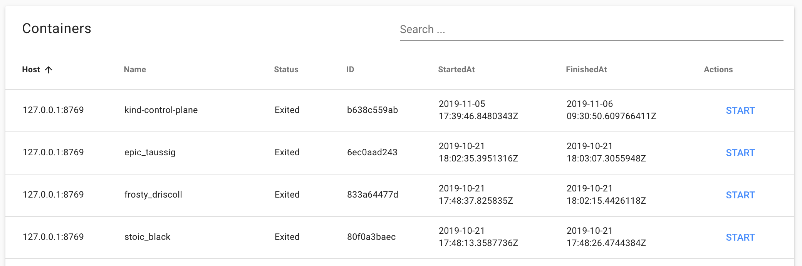

### Docker-UI
Simple UI for hosts with docker-containers on. Can collect dockers from multiple hosts.




### Usage
```
usage: docker-ui.py [-h] [--port PORT] [--host HOST] [-a ADD_HOST] [--debug]

optional arguments:
  -h, --help            show this help message and exit
  --port PORT           Port to listen on
  --host HOST           Host to listen on
  -a ADD_HOST, --add-host ADD_HOST
                        Add additional host with docker-ui
  --debug               Enable debug logs
```

Several hosts usage:
```
./docker-ui.py -a server-with-docker-ui.com -a server-with-docker-ui-2.com
```
